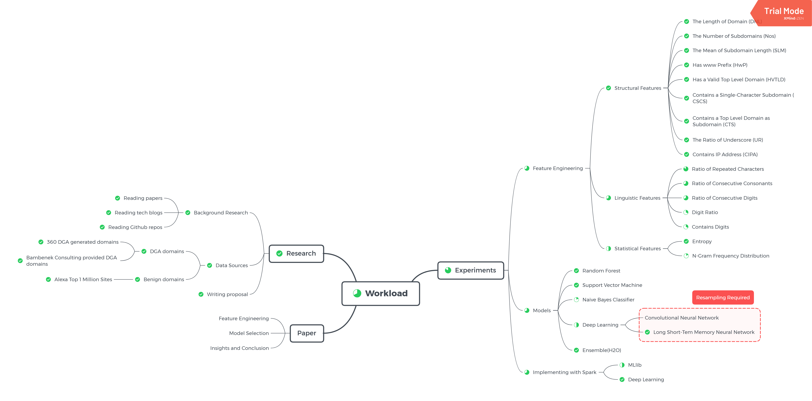

## CSYE 7245 Final Project - DGA Detection with Machine Learning and Deep Learning

## Course Information
* **School**: College of Engineering, Northeastern University
* **Course Name**: Big-Data Systems and Intelligence Analytics
* **Professor**: Nik Brown

## Group Members
- Haimin Zhang
- Lixi Zhou
- Shiqi Dai

## Contents
- [CSYE 7245 Final Project - DGA Detection with Machine Learning and Deep Learning](#csye-7245-final-project---dga-detection-with-machine-learning-and-deep-learning)
- [Course Information](#course-information)
- [Group Members](#group-members)
- [Contents](#contents)
- [Workload](#workload)
- [File Description](#file-description)
- [- LICENSE: the license for this project](#license-the-license-for-this-project)
- [Topic Description](#topic-description)
- [Attributs of the DGA dataset](#attributs-of-the-dga-dataset)
- [Background and Related Work](#background-and-related-work)
- [Data Sources](#data-sources)
    - [Benign Domains:](#benign-domains)
    - [Malicious DGA Domains:](#malicious-dga-domains)
- [Algorithms and Code Used](#algorithms-and-code-used)
    - [AutoML: H2O](#automl-h2o)
    - [Random Forest(RF)](#random-forestrf)
    - [SVM(Support Vector Machine)](#svmsupport-vector-machine)
    - [CNN(Convolutional Neural Network)](#cnnconvolutional-neural-network)
    - [LSTM(Long Short-Term Memory Neural Network)](#lstmlong-short-term-memory-neural-network)
- [Reading Materials](#reading-materials)
- [References](#references)

---
## Workload

---

**(Please use DGA_Detection.ipynb to run the project)**

## File Description

- `data`: contains the data used in the project
  - **360_dga.txt**: 360 DGA Domains
  - 360_dga_domain.csv: 360 DGA Doamins
  - bambenek_dga_domain.csv: Banbenek DGA Doamins
  - dga.txt: DGA Domains
  - dga-feed.txt: DGA Feed Domains
  - domain.csv: domains
  - **domain_withFeatures.csv**: Domain dataset with generated Features
  - **mixed_domain.csv**: Shuffle orginal dataset
  - public_suffix_list.txt: Public Suffix List
  - testData.csv
  - tlds-alpha-by-domain.txt: Top Valid Domain
  - **top-1m-domain.csv**: Alexa Top 1 Million Benign Domain
- `model`: contains the saved model
  - h2o_drf: the Random Forest Model generated by H2O
  - LSTM_on_100K: the LSTM model generated by Keras with 100k data
- `doc`: paper and related document
- DGA_Detection.ipynb: the main iPyhton notebook for this project
- LICENSE: the license for this project
---

**Note: The data folder is not  included in the zip file, because it is about 600MB. We upload our dataset to Google Drive, You can download it from the link below:**

**(Please access Google Drive with Northeastern Account)**:

https://drive.google.com/drive/folders/1m-p5_liIoSeX2pJhfMSCDDtTm3XyTCrq?usp=sharing

---

## Topic Description
Domain generation algorithms(DGA) are used in various families of malware, which generate a large plenty of domain names that can be used as rendezvous points with their command and control (C2) servers. Security vendors usually used blacklists to identify malware, but DGA can constantly update domain to evade the blacklist detection. In order to solve this problem, instead of using low-efficient traditional methods, we will use machine learning algorithms to detect DGAs and compare the performance of these algorithms.

## Attributs of the DGA dataset

- **DGA_Family**: represents the family of DGA

- **Domain**

- **Type**: represents that a domain is a DGA domain or Normal DGA **(This is the target variable which need to be predicted)**

| Type | Value|
| ----- | ----|
| Normal | 0 |
| DGA | 1 |

- **DNL** (Domain Name Length): represents the length of a domain

- **NoS** (Number of Subdomains): represents the number of subdomains ***(Ignore valid public suffixes)***

- **SLM** (Subdomain Length Mean): represents the mean of subdomain length ***(Ignore valid public suffixes)***

- **HwP** (Has www Prefix):

| HwP | Value|
| ----- | ----|
| Has www | 1 |
| Does not have | 0 |

- **HVTLD** (Has a Valid Top Level Domain):

| HVLTD | Value|
| ----- | ----|
| Has | 1 |
| Does not have | 0 |

- **CSCS** (Contains Single-Character Subdomain): ***(Ignore valid public suffixes)***

| CSCS | Value|
| ----- | ----|
| Has | 1 |
| Does not have | 0 |

- **CTS** (Contains Top Level Domain as Subdomain): ***(Ignore valid public suffixes)***

| CSCS | Value|
| ----- | ----|
| Has | 1 |
| Does not have | 0 |

- **UR** (Underscore Ratio): Reprents the ratio of underscore ***(Ignore valid public suffixes)***

- **CIPA** (Contains IP Address): ***(Ignore valid public suffixes)***

| CIPA | Value|
| ----- | ----|
| Contains IP Address | 1 |
| Does not contain | 0 |

- **contains_digit** (Contains digit): ***(Ignore valid public suffixes)***

| contains_digit | Value|
| ----- | ----|
| Contains digit | 1 |
| Does not contain digit | 0 |

- **vowel_ration** (The ratio of vowel): ***(Ignore valid public suffixes)***

- **digit_ratio** (The ratio of digit): ***(Ignore valid public suffixes)***

- **RRC** (The ratio of repeated characters in a subdomain): ***(Ignore valid public suffixes)***

- **RCC** (The ratio of consecutive consonants): ***(Ignore valid public suffixes)***

- **RCD** (The ratio of consecutive digits): ***(Ignore valid public suffixes)***

- **Entropy** (The entropy of subdomain): ***(Ignore valid public suffixes)***

## Background and Related Work
Internet security vendors have provided several strategies to intercept DGA traffic. In traditional, security providers would first decode the algorithm by applying reverse engineering. Generating a list of domains with a given seed, then preregister, sink-holed or put them into a DNS blacklist to prevent potential C2 traffic. Another common strategy is to find similar domain groups by using their statistical properties to determine if DGA generates a domain.  The main disadvantage of traditional strategies is the lack of capability to be used for real-time detection and protection.

Therefore, several strategies based on machine learning are introduced. FANCI is one of them. FANCI stands for Feature-based Automated NXDomain Classification and Intelligence, and it was introduced in 2018 by Schüppen, Teubert, Herrmann, and Meyer. It is a system for detecting infections with domain generation algorithm based malware by monitoring non-existent domain responses. FANCI mainly uses two supervised learning algorithms, random forests and support vector machine. Because of the using of RF and SVM, all the domain data(text) has to be represented by features. Schüppen et al.,(2018) described 21 features and used three different categories to group their features. They are structural features, linguistic features, and statistical features. Structural features have to subcategories as inherent structural features and non-self-explanatory structural features. Non-self-explanatory structural features can be some boolean type features or calculated ratio features. Linguistic features are used to measure the deviations from common linguistic patterns of domain names. Statistical features are n-gram frequency distribution and entropy which are common approaches in the feature engineering of domain data. According to Schüppen et al.,(2018), FANCI is based on supervised learning classifiers. It requires training with labeled data. Thus the first module is a training module. The output of the training module is a trained model, then the next module--classification module will use the model to classify new input data. Before classifying, classification module will also perform some preprocessing like feature extraction. In the end, the intelligence module will supply intelligence based on classification results, in particular, find infected devices and identify new DGAs or unknown seeds. FANCI is a very flexible system. There are two main usage scenarios, all-module using and distributed using.

However, the above traditional machine learning approaches have to use manually picked features to create classifiers like FANCI. They usually have two significant drawbacks: First, hand-crafted features are easy to circumvent by hackers. Second, getting hand-crafted features is relatively time-consuming at the runtime. Thus deep learning/neural network approaches have been taken seriously nowadays. Specific neural networks require less feature engineering and perform better at the run-time.  They work directly on raw domain names with a minimal transformation. In other words, if a new family of DGA shows up, the classifier can be retrained right away without the need for manual feature engineering. Also, neural network models act like the black box so it is hard for hackers to reverse and beat. Second, deep learning models have better "true positive"/"false positive" rate and real-time performance. In test cases, neural network classifiers are usually able to achieve satisfying accuracy.

## Data Sources
#### Benign Domains:

- [Alexa Top 1 Million Sites](https://www.kaggle.com/cheedcheed/top1m): The Alexa Top Sites web service provides access to lists of websites ordered by Alexa Traffic Rank. **(Size: 2,476,328)**
(https://www.kaggle.com/cheedcheed/top1m)

#### Malicious DGA Domains:

- [Bambenek Consulting provided malicious algorithmically-generated domains](http://osint.bambenekconsulting.com/feeds/dga-feed.txt) ([License](<http://osint.bambenekconsulting.com/license.txt>)) **(Size: 872,763)**
- [360 Lab DGA Domains](https://data.netlab.360.com/feeds/dga/dga.txt): A collection of domains generated by DGA and it is maintained by 360--a Chinese security vendor. This dataset keeps updated every day. **(Size: 1,169,720)**

## Algorithms and Code Used
#### AutoML: H2O
H2O has an industry leading AutoML functionality that automatically runs through all the algorithms and their hyperparameters to produce a leaderboard of the best models.
#### Random Forest(RF)
Random forest is a bunch of decision trees. It can be seen as an ensemble model. A random forest model will take all predicting results from its inner decision trees as a vote.
#### SVM(Support Vector Machine)
SVM is able to classify input data by using the computed hyperplane which is trained from the training set. In other words, given labeled training data, the algorithm outputs an optimal hyperplane which categorizes new examples.
#### CNN(Convolutional Neural Network)
Typically, CNN is used on image/audio data. It plays a vital role in cognitive computing like image/voice recognition. But there are some approaches on text classification that use CNN as the classifier.
#### LSTM(Long Short-Term Memory Neural Network)
Long short-term memory (LSTM) units are units of a recurrent neural network (RNN). An RNN composed of LSTM units is often called an LSTM network.

## Reading Materials
[DGA related paper](https://drive.google.com/drive/folders/1K0xcrlRFCabCF4kBSoSy038gLC4t5iA1?usp=sharing)

[FANCI-dga-detection source code](https://github.com/fanci-dga-detection/fanci)

[FANCI related presentation](https://www.usenix.org/conference/usenixsecurity18/presentation/schuppen)

[DGA classification and detection for automated malware analysis](https://cyber.wtf/2017/08/30/dga-classification-and-detection-for-automated-malware-analysis/)

[DGA Wiki](https://www.wikiwand.com/en/Domain_generation_algorithm)

[Botnet Wiki](https://www.wikiwand.com/en/Botnet#/Command_and_control)

[What Are DGAs and How to Detect them?(Good explaination)](https://aelladata.com/2018/02/11/what-are-dgas/)

[Use LSTM to detect DGA - 1](https://www.freebuf.com/articles/network/153345.html)

[Use LSTM to detect DGA - 2](https://www.freebuf.com/articles/network/139697.html)

[What Is NXDOMAIN?](https://www.dnsknowledge.com/whatis/nxdomain-non-existent-domain-2/)

[A DEATH MATCH OF DOMAIN GENERATION ALGORITHMS](https://blogs.akamai.com/2018/01/a-death-match-of-domain-generation-algorithms.html)

[Cognitive Research: Learning Detectors of Malicious Network Traffic](https://blogs.cisco.com/security/talos/machine-learning-detectors)

## References

[1]  Antonakakis, M., Perdisci, R., Nadji, Y., Vasiloglou, N., Abu-Nimeh, S., Lee, W., & Dagon, D. (2012, August). From Throw-Away Traffic to Bots: Detecting the Rise of DGA-Based Malware. In USENIX security symposium (Vol. 12).

[2]  AWS | Alexa Top Sites-Up-to-date lists of the top sites on the web. (n.d.). Retrieved from https:// aws.amazon.com/alexa-top-sites/

[3]  Domain generation algorithm. (n.d.). Retrieved from  https://www.wikiwand.com/en/Domai n_generation_algorithm

[4]  G. (2018, November 05). Google-research/bert. Retrieved from https://github.com/google-res earch/bert

[5]  H2O – Data Resource Portal. (n.d.). Retrieved from https://www.northeastern.edu/dataresource s/h2o

[6]  H. A., & J. W. (2018, February 22). Using Deep Learning to Detect DGAs. Retrieved from https://www.endgame.com/blog/technical-blog/using-deep-learning-detect-dgas

[7]  Koehrsen, W. (2018, June 02). Automated Feature Engineering in Python – Towards Data Science. Retrieved from https://towardsdatascience.com/automated-feature-engineering-in-python-99baf1 1cc219

[8]  Plohmann, D., Yakdan, K., Klatt, M., Bader, J., & Gerhards-Padilla, E. (2016, August). A Comprehensive Measurement Study of Domain Generating Malware. In USENIX Security Symposium (pp. 263-278).

[9]  Schiavoni, S., Maggi, F., Cavallaro, L., & Zanero, S. (2014, July). Phoenix: DGA-based botnet tracking and intelligence. In International Conference on Detection of Intrusions and Malware, and Vulnerability Assessment (pp. 192-211). Springer, Cham.

[10]  Schüppen, S., Teubert, D., Herrmann, P., Meyer, U., & Sch, S. (2018, August). FANCI: feature-based automated NXDomain classification and intelligence. In Proceedings of the 27th USENIX Conference on Security Symposium (pp. 1165-1181). USENIX Association.

[11]  Tran, D., Mac, H., Tong, V., Tran, H. A., & Nguyen, L. G. (2018). A LSTM based framework for handling multiclass imbalance in DGA botnet detection. Neurocomputing, 275, 2401-2413.

[12]  Woodbridge, J., Anderson, H., Ahuja, A., & Grant, D. (2016). Predicting Domain Generation Algorithms with Long Short-Term Memory Networks.

[13]  Yu, B., Pan, J., Hu, J., Nascimento, A., & De Cock, M. (2018). Character Level Based Detection of DGA Domain Names.
